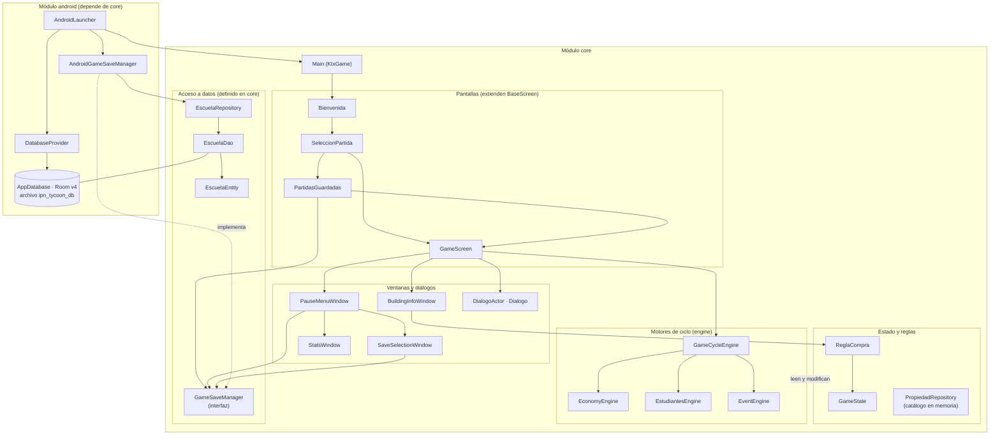
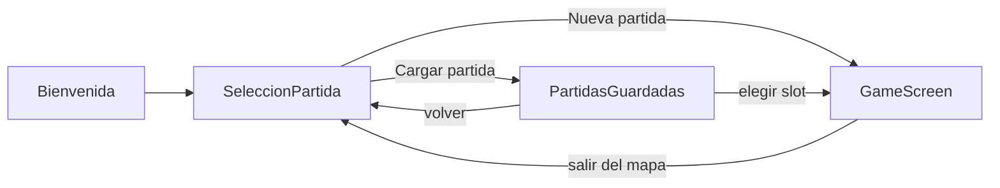

# Arquitectura de EduTycoon

Documento de la Entrega 1 (Partes 1 y 2). Describe cómo está organizado el repositorio y cómo se
comunican sus partes. Todo lo escrito aquí se comprobó contra el código de la rama `docs/entrega-1`;
cuando algo no se pudo confirmar, se dice explícitamente.

EduTycoon es un juego tycoon en **Kotlin + libGDX** que **solo corre en Android**. Tiene dos módulos
Gradle: `core` (lógica del juego y pantallas) y `android` (arranque y guardado en el dispositivo).

---

## 1. Estructura del repositorio

| Carpeta / archivo | Qué contiene |
|---|---|
| `core/` | Módulo de lógica y pantallas. Código en `core/src/main/kotlin/io/moviles/IPN_Tycoon/`, pruebas unitarias en `core/src/test/`. |
| `android/` | Módulo Android: `AndroidLauncher`, base de datos Room, `AndroidManifest.xml`, recursos (`res/`), reglas ProGuard y la prueba instrumentada `DatabaseTest`. |
| `assets/` | Recursos del juego que toma el módulo `android`: mapa Tiled (`Mapa/Mapa_General.tmx`, tilesets `.tsx`), sprites y fondos `.png` (273 imágenes) y la fuente `font.ttf`. |
| `gradle/` | Wrapper de Gradle (`wrapper/`) y `gradle-daemon-jvm.properties`, que fija el JDK del daemon (`toolchainVersion=21`). |
| `docs/` | Documentación de la entrega: `idea.md`, `diseno/`, `pruebas.md`, `evidencia/` y este documento. |
| `.github/workflows/` | Flujo de integración continua `ci.yml` (ver la sección 4). |
| `README_for_IAs/` | Notas de entorno, migración a Android 16 y publicación en Play Store, escritas para que una IA entienda el proyecto. |
| `PS/` | Material de la Play Store (logo y términos y condiciones). |
| `.artifacts/` | Cuatro planes en Markdown de funciones anteriores (aceleración económica, nombres flotantes de edificios, optimización multi-dispositivo y un resumen de implementación). Son notas de trabajo; ningún archivo de Gradle los usa. |
| `build.gradle`, `settings.gradle`, `gradle.properties` | Configuración de construcción (ver la sección 2). |
| `gradlew`, `gradlew.bat` | Scripts del wrapper para ejecutar Gradle sin instalarlo. |
| `LICENSE` | Licencia MIT del proyecto (ver `docs/licencias.md`). |
| `.editorconfig`, `.gitattributes` | Formato del código (espacios, `lf`, UTF-8) y finales de línea (`lf`, y `crlf` para `.bat`). |
| `policy_en_es.html` | Términos y condiciones, en español e inglés. |

---

## 2. Punto de entrada y archivos de construcción

**Punto de entrada.** El manifiesto declara `io.moviles.IPN_Tycoon.android.AndroidLauncher` como la
única actividad, con el filtro `MAIN` / `LAUNCHER` y orientación fija horizontal (`landscape`).
Al crearse, `AndroidLauncher.onCreate`:

1. obtiene la base de datos con `DatabaseProvider.getDatabase(this)`;
2. arma `EscuelaRepository` y `AndroidGameSaveManager`;
3. llama a `initialize(Main(saveManager), ...)` con el modo inmersivo activado.

`Main` (en `core`) es la clase de libGDX (`KtxGame`) que registra las cuatro pantallas
(`Bienvenida`, `SeleccionPartida`, `PartidasGuardadas`, `GameScreen`) y arranca en `Bienvenida`.

**Archivos de construcción.**

| Archivo | Para qué sirve |
|---|---|
| `settings.gradle` | Declara los dos módulos (`include 'core', 'android'`) y el plugin que permite descargar JDK automáticamente. |
| `build.gradle` (raíz) | Declara el plugin de Android (AGP **9.3.1**) y el de Kotlin, los repositorios y la configuración común. Para `core` fija Java 17 y define la tarea `generateAssetList`. |
| `core/build.gradle` | Dependencias del módulo `core` (sección 5). |
| `android/build.gradle` | `namespace` e `applicationId` `io.moviles.IPN_Tycoon`, `compileSdk` 36, `targetSdk` 36, `minSdk` 21, `versionCode` 5, `versionName` "1.3.1"; dependencias de Room; y la tarea `copyAndroidNatives`, que extrae las bibliotecas nativas (`.so`) de libGDX para las cuatro arquitecturas. |
| `gradle.properties` | Versiones de las bibliotecas (por ejemplo `kotlinVersion=2.2.10`, `gdxVersion=1.14.0`, `roomVersion=2.7.0-alpha13`) y ajustes de Gradle y de Android. |

> **Nota de consistencia.** `README_for_IAs/02-proyecto.md` menciona AGP 8.13.2, pero el
> `build.gradle` actual declara 9.3.1, que es la versión que se compila. Este documento usa la del
> `build.gradle`.

La tarea `generateAssetList` recorre `assets/` y escribe `assets/assets.txt` con la lista de archivos.
Se ejecuta en cada compilación de `core`, por eso ese archivo cambia solo (ver la sección 3).

---

## 3. Qué excluye `.gitignore` y por qué

| Grupo | Ejemplos | Motivo |
|---|---|---|
| Salida de compilación | `.gradle/`, `/build/`, `/android/build/`, `/core/build/`, `/.kotlin/` | Se regeneran en cada compilación; ocupan mucho espacio y cambian en cada máquina. |
| Archivos generados por el propio build | `/assets/assets.txt`, `/android/libs/<abi>/` | Los crea Gradle (`generateAssetList`, `copyAndroidNatives`). Subirlos generaría cambios ruidosos en cada commit. |
| Configuración local | `local.properties` | Contiene la ruta del Android SDK de cada computadora (`sdk.dir`). |
| Editores e IDE | `.idea/`, `*.iml`, `.project`, `.classpath`, `.settings/`, `nbproject/`, `*.swp` | Ajustes personales del editor de cada persona. |
| Compilados de Java | `*.class`, `*.war`, `*.ear`, `hs_err_pid*` | Son productos de compilación o volcados de fallos de la JVM. |
| Scripts de Python | `__pycache__/`, `*.pyc` | Caché de los scripts de `README_for_IAs/tools`. |
| Sistema operativo | `.DS_Store`, `Thumbs.db` | Metadatos del explorador de archivos. |
| Plantillas de otras plataformas | carpetas de `ios`, `html` (GWT), `teavm`, `lwjgl2`/`lwjgl3`, `headless`, `server`, `shared` | Heredadas de la plantilla de libGDX; este proyecto solo tiene `core` y `android`. |
| Seguridad (no deben salir del equipo) | `*.jks`, `*.keystore`, `*.p12`, `*.pem`, `*.key`, `keystore.properties`, `google-services.json`, `.env`, `secrets.properties` | Claves de firma y credenciales. Si llegaran a subirse, borrarlas no basta: quedan en el historial de git y habría que rotarlas. |
| Artefactos de release | `/android/release/`, `*.aab`, `*.apk`, `*.apks`, `native-debug-symbols*.zip` | Son pesados (el `.aab` ronda los 160 MB y GitHub rechaza archivos de más de 100 MB) y se pueden regenerar. |
| Mapeos de ProGuard/R8 | `mapping.txt`, `/android/build/outputs/mapping/` | Sirven para desofuscar errores de la app publicada; no son credenciales, pero no hace falta hacerlos públicos. |
| Copias de respaldo | `*_sensitive*`, `/_sensitive_backup/`, `*.jks.bak`, `*.orig` | Suelen terminar guardando información sensible. |
| Configuración de Graal | `**/resource-config.json` | Generado por la herramienta de compilación nativa de Graal (no se usa en este proyecto). |

---

## 4. Qué comprueba el CI

El archivo `.github/workflows/ci.yml` define el trabajo `build`. Se ejecuta en cada *pull request*
hacia `main` y en cada *push* a `main`, sobre `ubuntu-latest`, con un límite de 30 minutos. Pasos:

1. **`actions/checkout@v4`**: descarga el código.
2. **`actions/setup-java@v4`**: instala JDK **21** (Temurin), porque `gradle/gradle-daemon-jvm.properties`
   fija `toolchainVersion=21`.
3. **`gradle/actions/setup-gradle@v4`**: prepara Gradle y su caché.
4. **`./gradlew :core:test`**: ejecuta las pruebas unitarias de `core`.
5. **`./gradlew :android:assembleDebug`**: comprueba que el APK de depuración compila.
6. **Subida de reportes** (solo si algo falla): guarda `core/build/reports/tests/test/` como artefacto.

El CI **no** ejecuta la prueba instrumentada `DatabaseTest` (necesita un dispositivo o emulador) ni
firma ni publica nada. Tampoco instala el Android SDK: `ubuntu-latest` ya lo trae y el plugin de
Android descarga las herramientas que falten.

---

## 5. Diagrama de arquitectura

*Diagrama elaborado por Javier Gamez con apoyo de IA (Claude).*

**Cómo leerlo.** Las flechas continuas indican "usa o llama a". La flecha punteada indica que
`AndroidGameSaveManager` **implementa** la interfaz `GameSaveManager`, que vive en `core`. Así `core` no
depende de Android: solo conoce la interfaz, y el módulo `android` aporta la implementación real.

Para no saturar el dibujo, dos relaciones se resumen en texto:
- Los tres motores (`EconomyEngine`, `EstudiantesEngine` y `EventEngine`) leen y modifican
  `GameState`; `EconomyEngine` y `EstudiantesEngine` además recorren el catálogo de
  `PropiedadRepository`, y `EventEngine` también lo importa. Es la flecha "leen y modifican".
- `AndroidGameSaveManager` copia los datos de `GameState` y de `PropiedadRepository` hacia la fila de
  la base de datos al guardar, y en sentido contrario al cargar.

### Flujo de pantallas

*Diagrama elaborado por Javier Gamez con apoyo de IA (Claude).*

---

## 6. Dónde vive cada cosa

**Lógica del juego (`core`).**
- `GameState`: objeto único con el dinero, los alumnos, los ciclos jugados y los datos de la partida
  actual. Es el estado global.
- `Propiedad` y `PropiedadRepository`: cada edificio es una `Propiedad` (precio, capacidad,
  nivel máximo...). `PropiedadRepository` es un `object` declarado en `Propiedad.kt` que guarda el
  catálogo en un mapa **en memoria**. No es un repositorio de base de datos.
- `ReglaCompra`: decide si se puede comprar o mejorar (ver `docs/recorrido-codigo.md`).
- `engine/`: los motores que se ejecutan cada ciclo. `GameCycleEngine` avanza el ciclo y avisa a sus
  oyentes por orden de prioridad (`ResolutionOrder`). `EconomyEngine` acredita ingresos,
  `EstudiantesEngine` recalcula los alumnos y `EventEngine` lanza eventos aleatorios. En `GameScreen`,
  un temporizador avanza un ciclo cada **30 segundos** (`cycleDuration`).

**Interfaz (`core`).**
- Pantallas: `Bienvenida`, `SeleccionPartida`, `PartidasGuardadas` y `GameScreen`. `GameScreen`
  dibuja el mapa isométrico de Tiled con `IsometricTiledMapRenderer`.
- Ventanas: `BuildingInfoWindow` (comprar o mejorar), `PauseMenuWindow` (con `SaveSelectionWindow` y
  `StatsWindow`) y los diálogos del tutorial (`Dialogo`, `DialogoActor`).
- Se construye con scene2d y KTX sobre la biblioteca de widgets VisUI.

**Acceso a datos.**
- En `core`: la interfaz `GameSaveManager`, `EscuelaRepository`, `EscuelaDao` y `EscuelaEntity`
  (solo anotaciones de Room, sin código de Android).
- En `android`: `AppDatabase`, `DatabaseProvider` y `AndroidGameSaveManager`, que usan Room de verdad.
- **Qué se guarda.** Una fila por partida en la tabla `escuelas` (nombre del jugador y de la escuela,
  dinero, ciclos, alumnos y los edificios comprados como texto `"id:nivel,..."`).
- **Detalles que conviene conocer:**
  - `AppDatabase` registra solo `EscuelaEntity`. Existen también `RecursoEntity`, `RecursoDao` y
    `RecursoRepository` en `core`, pero **`RecursoEntity` no está registrada en `AppDatabase`**.
  - `DatabaseProvider` usa `fallbackToDestructiveMigration()`: si cambia la versión del esquema, Room
    borra los datos guardados en lugar de migrarlos.

**Pruebas.** En `core/src/test/`: `GameStateTest`, `ReglaCompraTest` y `GameCycleEngineTest`
(14 pruebas en total). En `android/src/androidTest/`: `DatabaseTest`, que necesita un dispositivo.

---

## 7. Dependencias externas y para qué sirven

Versiones tomadas de `gradle.properties`; dependencias declaradas en `core/build.gradle` y
`android/build.gradle`.

| Dependencia | Versión | Para qué se usa |
|---|---|---|
| libGDX (`gdx`, `gdx-freetype`, `gdx-backend-android`) | 1.14.0 | Motor de juego: ciclo de vida, dibujo, entrada táctil, carga del mapa Tiled (`TmxMapLoader`, `IsometricTiledMapRenderer`) y texto con la fuente `font.ttf` (FreeType). |
| libKTX (`ktx-scene2d`, `ktx-app`, `ktx-assets`, `ktx-actors`, `ktx-async`) | 1.13.1-rc1 | Extensiones de Kotlin para libGDX. Son las familias de KTX que el código importa realmente. |
| VisUI (`vis-ui`) | 1.5.5 | Estilo y widgets de la interfaz (`VisWindow`, botones, skin). |
| Room (`room-common` en `core`; `room-runtime`, `room-ktx`, `room-compiler` con `kapt` en `android`) | 2.7.0-alpha13 | Base de datos local SQLite para las partidas guardadas. |
| Declaradas pero **sin uso en el código** | | Una búsqueda de imports en `core` y `android` no encontró uso de: Ashley (1.7.4), gdx-ai (1.8.2), artemis-odb (2.3.0), `gdx-box2d` (1.14.0), AndroidX Lifecycle (2.8.7) ni de las demás familias de KTX declaradas (por ejemplo `ktx-tiled`, `ktx-box2d`, `ktx-inject`). Parecen heredadas de la plantilla de libGDX. |
| Kotlin (`kotlin-stdlib`) | 2.2.10 | Lenguaje del proyecto. |
| kotlinx-coroutines | 1.10.2 | Operaciones de base de datos fuera del hilo principal (`Dispatchers.IO`). |
| `desugar_jdk_libs` | 2.1.5 | Permite usar APIs recientes de Java en versiones antiguas de Android. |
| JUnit | 4.13.2 | Pruebas unitarias. |
| AndroidX Test | 1.2.1 / 1.6.2 / 1.6.1 | Solo para la prueba instrumentada `DatabaseTest`. |

Las licencias de estas dependencias están en `docs/licencias.md`.

---

## 8. Qué corre en el dispositivo y qué depende de servicios externos

**Todo corre en el dispositivo.**
- El juego, el mapa y los recursos van dentro del APK.
- Las partidas se guardan en la base SQLite local (`ipn_tycoon_db`).

**No hay servicios externos en tiempo de ejecución.**
- `android/AndroidManifest.xml` **no declara el permiso `INTERNET`**.
- Una búsqueda en el código (`core` y `android`) de `http`, `URL(`, sockets, Firebase, analíticas o
  anuncios **no encontró coincidencias**.
- Por eso la app no puede conectarse a internet ni depende de un servidor.

**Servicios externos que sí existen, pero solo al construir.**
- Al compilar, Gradle descarga bibliotecas de Maven Central, Google, Gradle Plugin Portal, JitPack y
  los repositorios de snapshots de Sonatype (`build.gradle`).
- También puede descargar un JDK con el complemento `foojay-resolver` (`settings.gradle`).
- Estos accesos ocurren en la computadora del desarrollador o en el CI, no en el celular del jugador.
