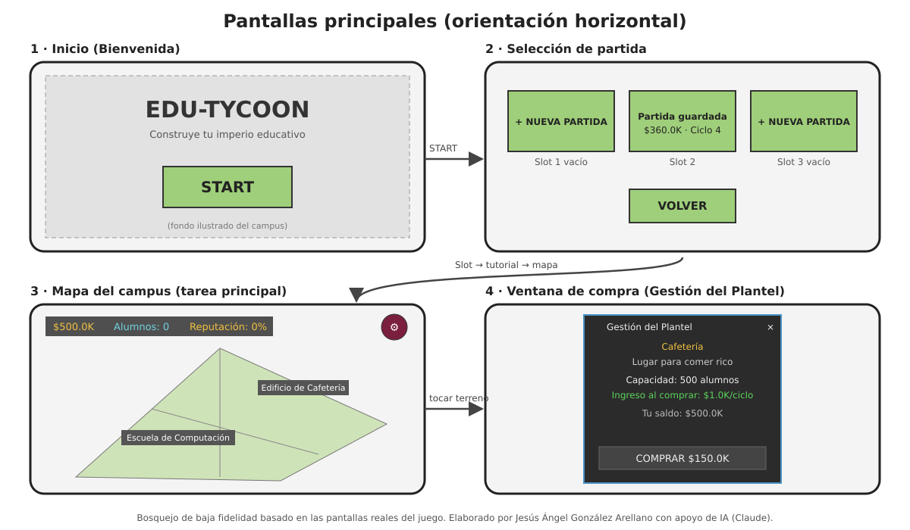
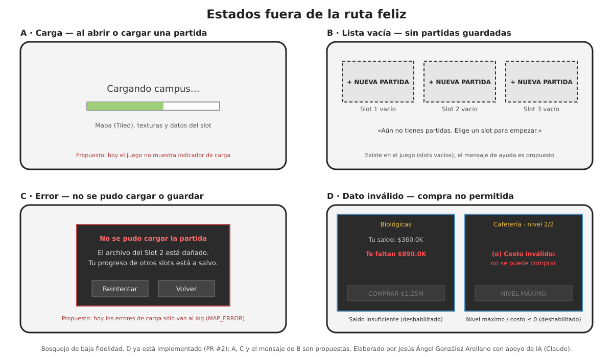
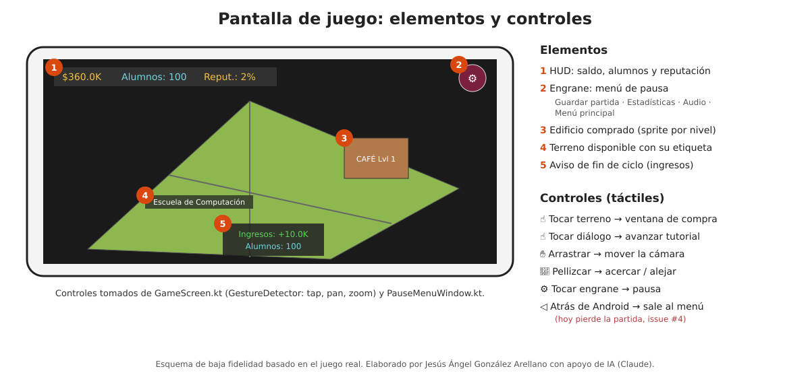
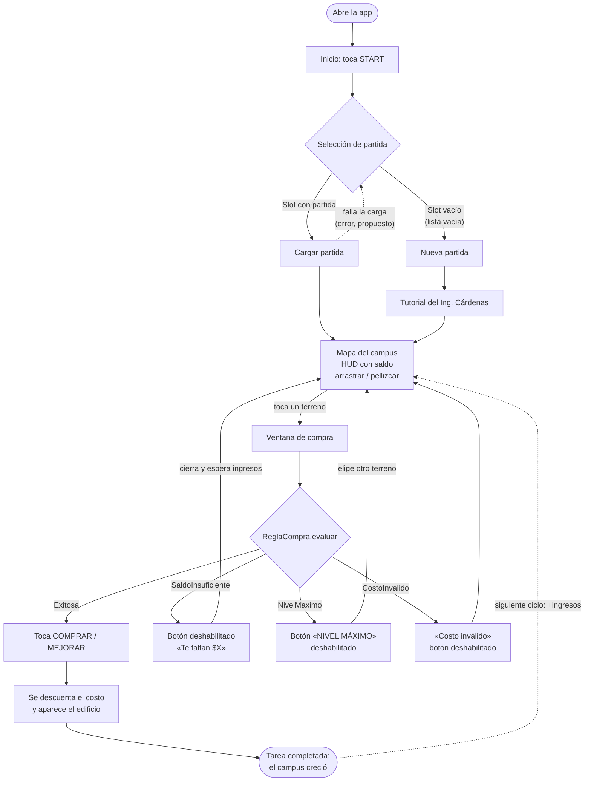

# Material visual de la idea

Bosquejos de baja fidelidad de *EduTycoon: Campus en ruta* (ver
[`docs/idea.md`](../idea.md)). Se basan en las pantallas reales del juego;
lo que todavía no existe se marca como **propuesto**.

> **Autoría:** todos los bosquejos y diagramas de esta carpeta fueron
> elaborados por **Jesús Ángel González Arellano con apoyo de IA (Claude)**.

---

## 1. Pantallas principales

*Figura 1. Pantallas principales y cómo se navega entre ellas: Inicio →
Selección de partida → Mapa del campus → Ventana de compra. Elaborado por
Jesús Ángel González Arellano con apoyo de IA (Claude).*

## 2. Estados fuera de la ruta feliz

*Figura 2. Estados alternos. Elaborado por Jesús Ángel González Arellano con
apoyo de IA (Claude).*

| Estado | Dónde aparece | Situación actual |
|---|---|---|
| **A. Carga** | Al abrir o cargar una partida | Propuesto: hoy no hay indicador de carga |
| **B. Lista vacía** | Selección de partida sin partidas guardadas | Ya existe («Slot N vacío»); el mensaje de ayuda es propuesto |
| **C. Error** | No se pudo cargar o guardar un slot | Propuesto: hoy el error sólo se escribe en el log (`MAP_ERROR`) |
| **D. Dato inválido** | Ventana de compra: saldo insuficiente, nivel máximo o costo ≤ 0 | ✅ Implementado en el PR #2 (issue #1) |

## 3. Pantalla de juego: elementos y controles

*Figura 3. Esquema de la pantalla de juego. Los controles se tomaron del
código: `GameScreen.kt` (`GestureDetector`: tocar, arrastrar, pellizcar) y
`PauseMenuWindow.kt`. Elaborado por Jesús Ángel González Arellano con apoyo
de IA (Claude).*

## 4. Recorrido del usuario

Desde que abre la aplicación hasta que completa la tarea principal (comprar o
mejorar un edificio), incluyendo los estados alternos.

*Figura 4. Recorrido del usuario hasta completar la tarea principal.
Elaborado por Jesús Ángel González Arellano con apoyo de IA (Claude).*
