# Entrega 1 del Proyecto — Idea, proyecto elegido y primer Pull Request

## Portada

- **Integrantes:**
  - Jesús Ángel González Arellano — boleta 2022630690 — GitHub `jesusGoliat`
  - Javier Gamez — boleta 2022630007 — GitHub `Javier-Gamez`
- **Grupo:** 7CV4
- **Asignatura:** Desarrollo de aplicaciones móviles nativas
- **Profesor:** Gabriel Hurtado Avilés
- **Ruta elegida:** EduTycoon
- **Repositorio del equipo:** <https://github.com/jesusGoliat/EDU_Tycoon> (fork de `gabrielhuav/EDU_Tycoon`)
- **Fecha de entrega:** 5 de octubre de 2026

---

## Estructura del repositorio

```text
EDU_Tycoon/
├── android/                 Launcher de Android, manifiesto, Room (AppDatabase, AndroidGameSaveManager)
├── core/                    Lógica y UI del juego (libGDX + KTX), motores de ciclo, ReglaCompra
│   └── src/test/            Pruebas unitarias JUnit 4 (GameStateTest, ReglaCompraTest, GameCycleEngineTest)
├── assets/                  Mapa de Tiled, sprites y fuentes
├── .github/workflows/ci.yml Integración continua: :core:test + :android:assembleDebug
└── docs/
    ├── idea.md              Parte 1 · ficha de idea, historia de usuario y criterio de aceptación
    ├── diseno/              Parte 1 · bosquejos, estados alternos y recorrido del usuario
    ├── arquitectura.md      Parte 2 · estructura, .gitignore, CI, diagrama y dependencias
    ├── recorrido-codigo.md  Parte 2 · compra de un edificio de principio a fin
    ├── licencias.md         Parte 2 · licencia MIT y procedencia de recursos
    ├── pruebas.md           Parte 2 y 3 · matriz de pruebas y QA de la característica
    ├── evidencia/entrega-1/ Capturas de ejecución de cada integrante y de QA
    └── informe/             Este informe y sus capturas
```

---

## Resumen

Elegimos la ruta **EduTycoon**, un juego de gestión en Kotlin + libGDX
ambientado en el IPN. Propusimos una idea propia sobre ese proyecto
(*Campus en ruta*: sesiones cortas de juego sin perder el progreso), documentamos
cómo está construido, lo ejecutamos cada uno en su computadora y en celulares
físicos, y entregamos la característica pedida para la ruta: **una regla de
compra que impide gastar más saldo del disponible**, mediante un Pull Request
con QA, revisión cruzada, integración continua en verde y la etiqueta
`parcial-1`.

| Parte | Documento | Contenido |
|---|---|---|
| 1 | [`docs/idea.md`](../idea.md) | Ficha de idea, historia de usuario y criterio de aceptación |
| 1 | [`docs/diseno/`](../diseno/) | Bosquejos, estados alternos, pantalla de juego y recorrido del usuario |
| 2 | [`docs/arquitectura.md`](../arquitectura.md) | Estructura, `.gitignore`, CI, diagrama de arquitectura y dependencias |
| 2 | [`docs/recorrido-codigo.md`](../recorrido-codigo.md) | Recorrido de la compra de un edificio con código real |
| 2 | [`docs/licencias.md`](../licencias.md) | Licencia y procedencia de recursos |
| 2 | [`README.md`](../../README.md) | Pasos de ejecución desde un clon limpio |
| 2 y 3 | [`docs/pruebas.md`](../pruebas.md) | Matriz de pruebas base (7 casos) y QA de la característica (6 casos) |
| 3 | [PR #2](https://github.com/jesusGoliat/EDU_Tycoon/pull/2) | Característica completa con QA, revisión y CI |

---

## Parte 1 · Idea original de la aplicación

**Problema en una frase:** los estudiantes que quieren jugar un tycoon en el
celular durante sus traslados cortos pierden el progreso o se frustran con
compras que no entienden, porque estos juegos están pensados para sesiones
largas.

| Campo | Resumen (detalle en [`docs/idea.md`](../idea.md)) |
|---|---|
| Usuario y contexto | Estudiante del IPN de primeros semestres; juega en el Metro o entre clases, en sesiones de 5 a 10 minutos |
| Tarea principal | Comprar o mejorar un edificio con el presupuesto disponible |
| Criterio de éxito | Primera compra en menos de 2 min; progreso conservado al salir; nunca saldo negativo |
| Alcance v1 | Regla de compra (hecha, PR #2), ingresos por ciclo, guardar al salir (#4), tutorial |
| Aplazado | Docentes, eventos complejos, reputación, escalado de texto (#5), publicación en Play |
| Evidencia | **Hipótesis sin validar**; se apoya en nuestra experiencia y en el QA del 25/09/2026 |

**Historia de usuario:** *Como estudiante del IPN que juega en el Metro camino
a clases, quiero comprar y mejorar edificios de mi campus sabiendo si me
alcanza el presupuesto, para hacer crecer mi escuela en sesiones cortas sin
gastar de más ni frustrarme.*

**Criterio de aceptación:** *Dado que tengo un saldo de $100,000 y un edificio
cuesta $120,000, cuando abro la ventana de ese edificio, entonces el botón
COMPRAR aparece deshabilitado, se muestra «Te faltan $20.0K» y mi saldo sigue
en $100,000.*

**Bosquejo de las pantallas principales**


**Estados fuera de la ruta feliz: carga, lista vacía, error y dato inválido**


**Esquema de la pantalla de juego con sus elementos y controles**


El recorrido del usuario (diagrama) está en
[`docs/diseno/README.md`](../diseno/README.md#4-recorrido-del-usuario). Todas
las figuras indican su autor y que se elaboraron con apoyo de IA (Claude).

---

## Parte 2 · El proyecto elegido: arquitectura, código y repositorio

### Arquitectura y recorrido del código

- **Estructura, punto de entrada, `.gitignore`, CI, diagrama de arquitectura,
  dependencias y qué corre en el dispositivo:**
  [`docs/arquitectura.md`](../arquitectura.md).
- **Recorrido de una funcionalidad (comprar un edificio)** desde el toque en
  el mapa hasta el resultado en pantalla, con fragmentos reales de
  `GameScreen.kt`, `BuildingInfoWindow.kt`, `ReglaCompra.kt`, `GameState.kt` y
  `EconomyEngine.kt`, y qué archivos modificar para cambiarla:
  [`docs/recorrido-codigo.md`](../recorrido-codigo.md).
- **Licencia (MIT) y procedencia de recursos:** [`docs/licencias.md`](../licencias.md).

### Entorno utilizado

| | Jesús | Javier |
|---|---|---|
| Sistema operativo | Ubuntu 24.04.5 LTS (ThinkPad E460) | Windows 11 Home (10.0.26200) |
| JDK | OpenJDK 21.0.12 | Sistema: Oracle JDK 24.0.2 · Gradle usó JetBrains JDK 21.0.11 |
| Construcción | Gradle 9.5.0 (wrapper), AGP 9.3.1, Kotlin 2.2.10, compileSdk 36, Build-Tools 36 | Igual (wrapper del proyecto) |
| Herramientas | adb 1.0.41, scrcpy 4.1 | Android Studio (compilación 261.26222.65), Git Bash |
| Dispositivos | Xiaomi POCO 2207117BPG (Android 13, API 33): todo el QA. Además se instaló y abrió el APK en un Samsung SM-G998U (Android 14) el 24/09 | Samsung SM-G998U |

Los pasos exactos para ejecutar el proyecto desde un clon limpio están en el
[`README.md`](../../README.md) del repositorio.

### Problemas encontrados durante la primera ejecución

| # | Quién / dónde | Problema | Causa | Solución |
|---|---|---|---|---|
| 1 | Javier, Windows 11 | El JDK del sistema es el 24, pero el proyecto exige el 21 | `gradle/gradle-daemon-jvm.properties` fija `toolchainVersion=21` | Gradle usó el JetBrains JDK 21.0.11 ya instalado (comprobado con `./gradlew javaToolchains`) |
| 2 | Javier, Windows 11 | `:core:test` terminaba **sin imprimir nada** y parecía un fallo | `gradle.properties` tiene `org.gradle.logging.level=quiet` | Se verificó con el código de salida (0) y los reportes en `core/build/test-results/test/` |
| 3 | Javier, Windows 11 | `cmd /c "gradlew.bat ..."` desde PowerShell: *«"gradlew.bat" no se reconoce como un comando…»* | No se investigó la causa exacta | Se usó `./gradlew` desde Git Bash |
| 4 | Javier, Samsung SM-G998U | `INSTALL_FAILED_UPDATE_INCOMPATIBLE: … signatures do not match` | Ya había una app con el mismo `applicationId` firmada con otra clave | Se desinstaló la app anterior (borra sus datos) y se reinstaló con `adb install -r` |
| 5 | Jesús, Ubuntu | Gradle pidió **Android SDK Build-Tools 36**, que no estaban instaladas | El proyecto compila con `compileSdk 36` | Gradle las descargó e instaló solo |
| 6 | Equipo, GitHub Actions | La primera corrida del CI **falló** en `android-actions/setup-android@v3` | La acción intenta instalar el paquete antiguo `tools`, que `sdkmanager` ya no ofrece | Se quitó ese paso: `ubuntu-latest` ya trae el SDK (commit `38eb79e`) |
| 7 | Jesús, Xiaomi | `adb install` falló con `INSTALL_FAILED_USER_RESTRICTED` | MIUI bloquea instalaciones por USB | Activar *Opciones de desarrollador → Instalar vía USB* y aceptar el aviso en el teléfono |
| 8 | Todo el equipo | Cada build regenera `assets/assets.txt` | La tarea `generateAssetList` lo escribe | Ya está en `.gitignore` (`/assets/assets.txt`); aun así se revisa `git status` antes de cada commit |

**Fallo de la integración continua y su corrección: ✗ en `d6097df` y ✓ desde `38eb79e`**

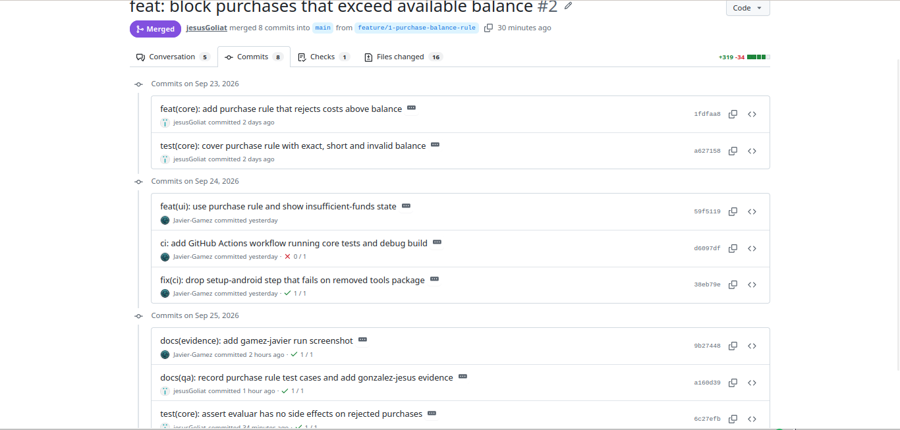

### Ejecución verificada por cada integrante

**Jesús: app corriendo en el Xiaomi (espejo con scrcpy) junto a `git config user.name`**

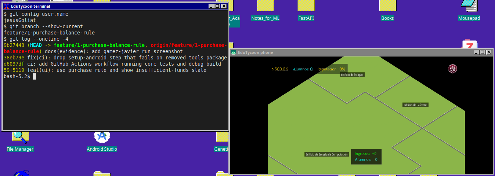

**Javier: app corriendo en su celular junto a `git config user.name`**

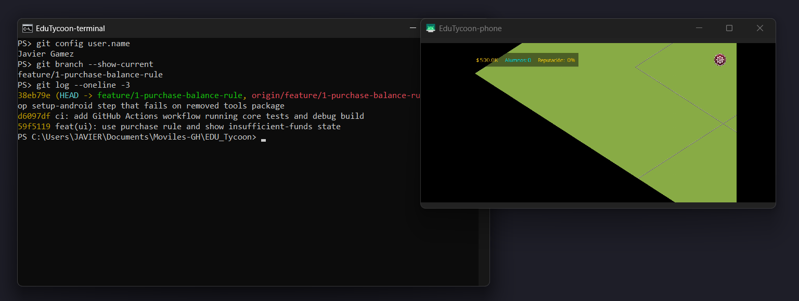

### Matriz inicial de pruebas

Siete casos base del juego completo en un celular físico: flujo principal,
slots vacíos, compra inválida, rotación, salir con Inicio, modo avión y texto
ampliado. Cinco pasan; fallan **Atrás** (pierde la partida, issue
[#4](https://github.com/jesusGoliat/EDU_Tycoon/issues/4)) y **texto ampliado**
(issue [#5](https://github.com/jesusGoliat/EDU_Tycoon/issues/5)). Detalle y
fotografías en [`docs/pruebas.md`](../pruebas.md).

---

## Parte 3 · Pull Request completo

### 3.1 y 3.2 · Característica e issue

Regla de compra que impide gastar más saldo del disponible, con estados
alternos de **saldo insuficiente**, **nivel máximo** y **costo inválido**.

**Issue #1: título, comportamiento actual y deseado**

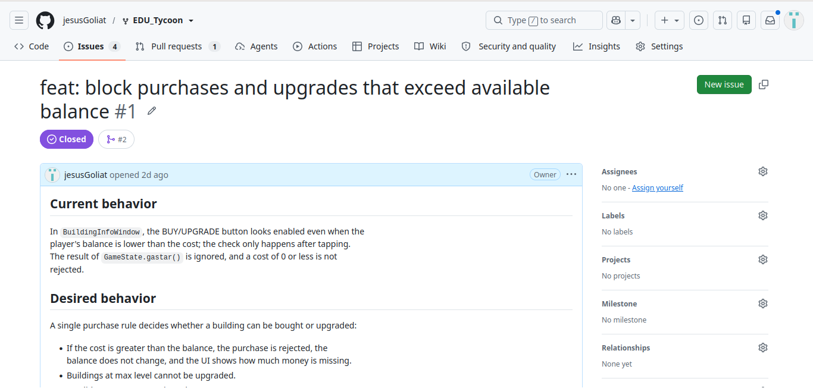

**Issue #1: criterio de aceptación y PR que lo cierra**

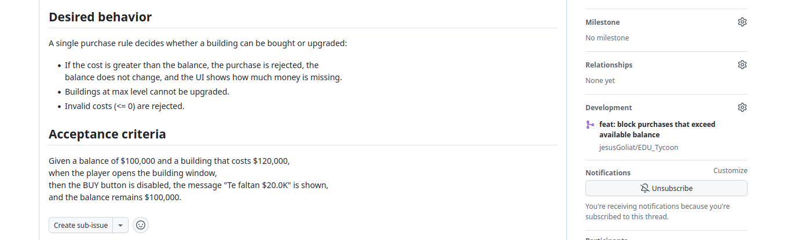

### 3.3 y 3.4 · Rama y commits de cada integrante

Rama `feature/1-purchase-balance-rule` creada desde `main`. **8 commits: 4 de
cada integrante**, sin reescribir el historial.

| # | Autor | Commit |
|---|---|---|
| 1 | jesusGoliat | `feat(core): add purchase rule that rejects costs above balance` |
| 2 | jesusGoliat | `test(core): cover purchase rule with exact, short and invalid balance` |
| 3 | Javier-Gamez | `feat(ui): use purchase rule and show insufficient-funds state` |
| 4 | Javier-Gamez | `ci: add GitHub Actions workflow running core tests and debug build` |
| 5 | Javier-Gamez | `fix(ci): drop setup-android step that fails on removed tools package` |
| 6 | Javier-Gamez | `docs(evidence): add gamez-javier run screenshot` |
| 7 | jesusGoliat | `docs(qa): record purchase rule test cases and add gonzalez-jesus evidence` |
| 8 | jesusGoliat | `test(core): assert evaluar has no side effects on rejected purchases` |

**Historial de commits del PR con la participación de ambos integrantes**


### 3.5 y 3.6 · Pull Request y QA

PR #2 abierto como **Draft**, en inglés, con las secciones *What changed? ·
Why? · QA evidence · Risk / rollback* y `Closes #1`. Se marcó *Ready for
review* sólo después del QA en un celular físico (4 casos de la característica
pasan; 2 fallos preexistentes registrados como issues).

**PR #2: sección Why y QA evidence con dispositivo, versión y resultados**

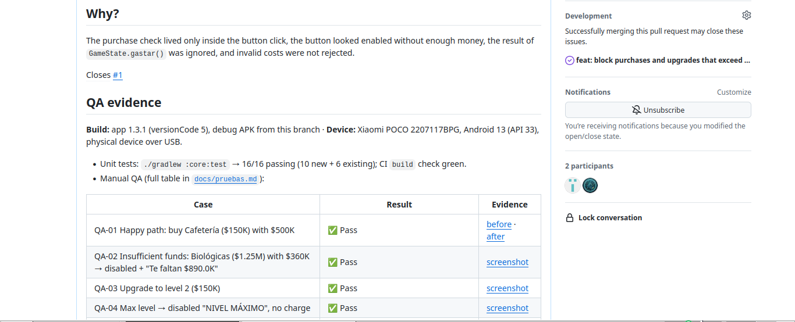

### 3.7 · Revisión de un compañero

Javier leyó el diff, corrió las pruebas en su máquina (14/14), probó el APK en
su celular y **aprobó**, dejando dos comentarios sobre líneas concretas. Se
respondieron en el PR: uno se corrigió con el commit 8 (dos pruebas nuevas,
16/16) y el otro se registró como el issue
[#7](https://github.com/jesusGoliat/EDU_Tycoon/issues/7).

**Aprobación de Javier en la conversación del PR**

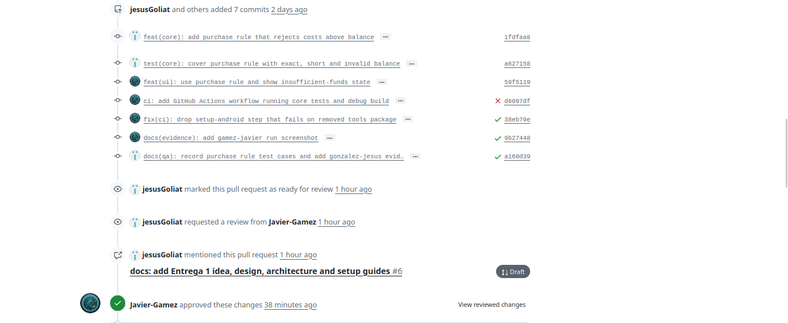

**Comentario general de la revisión y los dos hilos resueltos**

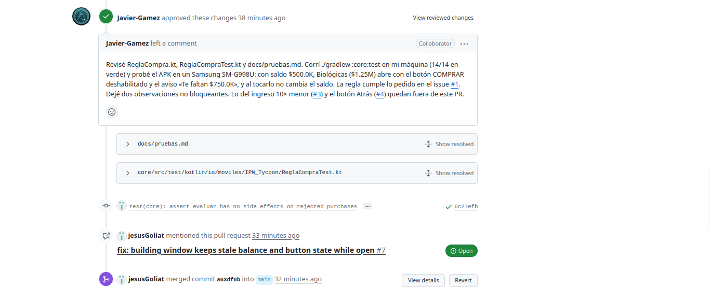

**Hilo 1 (`docs/pruebas.md`): comentario de Javier y respuesta (se registró como #7)**

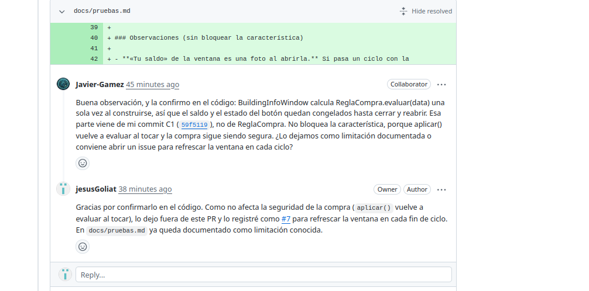

**Hilo 2 (`ReglaCompraTest.kt`): comentario de Javier y respuesta (corregido en `6c27efb`)**

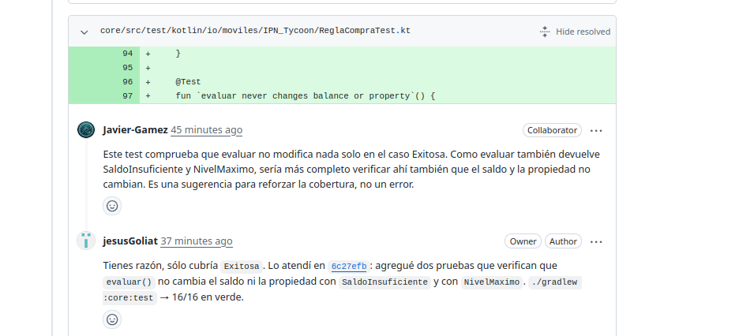

### 3.8 · Checks, integración y etiqueta

**Ejecución de la integración continua en verde (`:core:test` y `:android:assembleDebug`)**

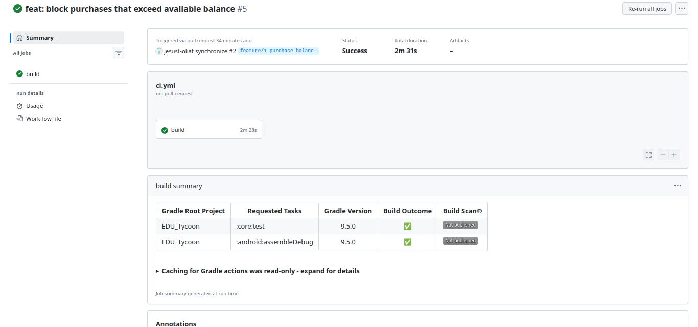

Se integró a `main` con *merge commit* (conserva la autoría de los 8 commits)
sólo con la aprobación, los hilos resueltos y el check `build` en verde, que
son obligatorios por la protección de `main`. Después se creó la etiqueta:

```bash
git tag -a parcial-1 -m "Entrega 1 del proyecto"
git push origin parcial-1
```

**Etiqueta `parcial-1` sobre el commit integrado `a63df8b`**

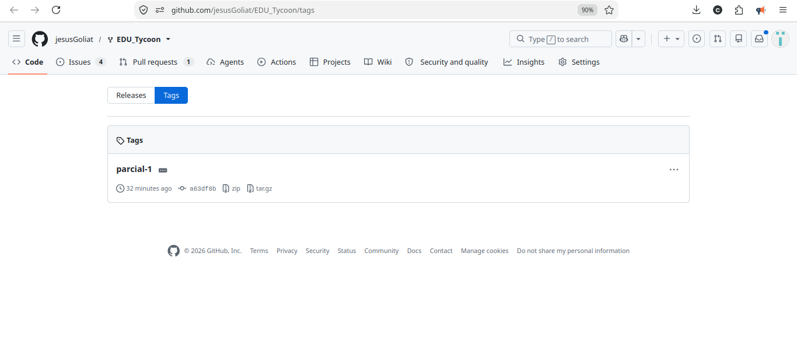

---

## Ligas de verificación

| Evidencia | Liga |
|---|---|
| Repositorio | <https://github.com/jesusGoliat/EDU_Tycoon> |
| Issue de la característica | <https://github.com/jesusGoliat/EDU_Tycoon/issues/1> |
| Pull Request | <https://github.com/jesusGoliat/EDU_Tycoon/pull/2> |
| Ejecución de CI del PR | <https://github.com/jesusGoliat/EDU_Tycoon/actions/runs/36212252740> |
| Etiqueta `parcial-1` | <https://github.com/jesusGoliat/EDU_Tycoon/releases/tag/parcial-1> |
| Defectos registrados | [#3](https://github.com/jesusGoliat/EDU_Tycoon/issues/3) · [#4](https://github.com/jesusGoliat/EDU_Tycoon/issues/4) · [#5](https://github.com/jesusGoliat/EDU_Tycoon/issues/5) · [#7](https://github.com/jesusGoliat/EDU_Tycoon/issues/7) |

---

## Uso de asistentes de IA

_(Pendiente: el equipo definirá la redacción al terminar la práctica.)_

---

## Conclusiones

_(Pendiente: cada integrante escribe su conclusión en primera persona — qué
entendía antes y qué entiende ahora del flujo issue → rama → PR → QA →
revisión → CI → etiqueta, y qué le sorprendió.)_

### Jesús

Antes de esta entrega veía el Pull Request como el último paso para "subir"
código. Ahora entiendo que es donde se demuestra que el cambio funciona: el
issue define qué se va a probar, el QA en un celular real lo confirma y la
revisión de mi compañero encontró cosas que yo no había visto, como que la
prueba de `evaluar()` sólo cubría el caso exitoso.

Lo que más me sorprendió fue lo que apareció al probar en el dispositivo y no
en las pruebas unitarias: el botón Atrás borraba la partida y el juego ignoraba
el tamaño de texto del sistema. También que el CI fallara la primera vez por
una acción de GitHub desactualizada y no por nuestro código; leer el log antes
de tocar nada fue lo que permitió corregirlo en un solo commit. Para la
siguiente entrega me quedo con dividir el trabajo por archivos desde el inicio,
porque así nunca tuvimos conflictos trabajando los dos sobre la misma rama.

### Javier

Antes de este trabajo entendía git como una herramienta para guardar y subir
cambios; no había seguido un flujo completo en el que cada paso deja evidencia
verificable. Ahora entiendo la cadena completa: el issue define el problema y
el criterio de aceptación; la rama (`feature/1-purchase-balance-rule`) aísla el
trabajo; el pull request en Draft reúne los commits y la evidencia de QA; el QA
en un celular físico comprueba el comportamiento real; la revisión de otra
persona valida el trabajo antes de integrarlo; el CI repite las pruebas y la
compilación en un entorno limpio; y la etiqueta `parcial-1` marca el commit
integrado.

Lo que más me sorprendió fue que cada paso me dio información que no esperaba.
El CI falló en su primera corrida por un paso de `setup-android` que intentaba
instalar un paquete `tools` que ya no existe, y lo arreglé quitando ese paso (mi
commit `38eb79e`). Mi revisión no fue un trámite: uno de mis comentarios sobre
`ReglaCompraTest` terminó en dos pruebas nuevas (16/16) y el otro se convirtió
en el issue #7. También me sorprendió que Gradle no imprima nada cuando todo
sale bien por `logging.level=quiet`, y que la instalación fallara con
`INSTALL_FAILED_UPDATE_INCOMPATIBLE` porque mi celular ya tenía la app firmada
con otra clave. Aprendí que un fallo documentado, con su causa y su solución,
vale más que uno que se omite.

---

## Referencias (APA)

- Badlogic Games. (s.f.). *libGDX documentation*. https://libgdx.com/wiki/
- Conventional Commits. (s.f.). *Conventional Commits 1.0.0*. https://www.conventionalcommits.org/es/v1.0.0/
- GitHub. (s.f.). *About pull request reviews*. https://docs.github.com/en/pull-requests/collaborating-with-pull-requests/reviewing-changes-in-pull-requests/about-pull-request-reviews
- GitHub. (s.f.). *About rulesets*. https://docs.github.com/en/repositories/configuring-branches-and-merges-in-your-repository/managing-rulesets/about-rulesets
- GitHub. (s.f.). *Understanding GitHub Actions*. https://docs.github.com/en/actions/about-github-actions/understanding-github-actions
- Google. (s.f.). *Android Gradle plugin release notes*. https://developer.android.com/build/releases/gradle-plugin
- Hurtado Avilés, G. (s.f.). *EDU_Tycoon* [Repositorio]. GitHub. https://github.com/gabrielhuav/EDU_Tycoon
- libktx. (s.f.). *KTX: Kotlin extensions for libGDX*. https://github.com/libktx/ktx
