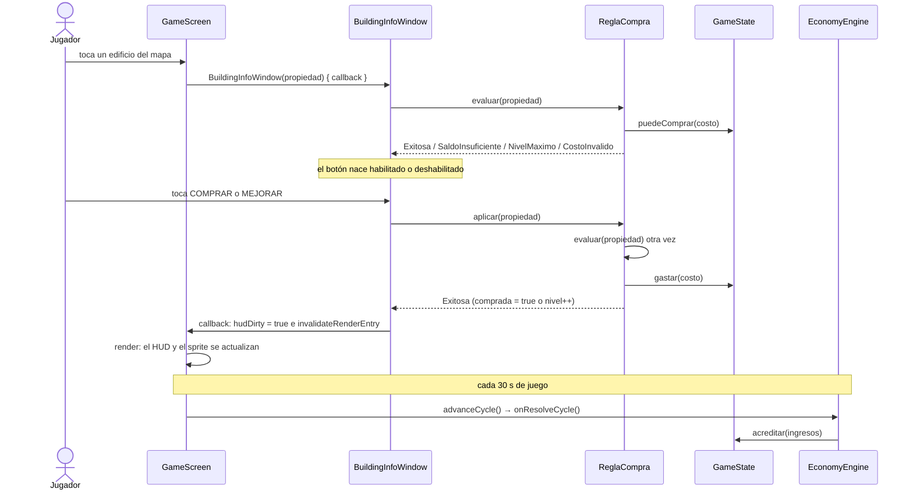

# Recorrido del código: comprar un edificio

Documento de la Entrega 1 (Parte 2). Sigue **una funcionalidad que ya existe**, la compra (y mejora) de
un edificio, desde el toque del jugador hasta el saldo que se ve en pantalla y el ingreso del ciclo
siguiente. Los fragmentos son copias **reales** del código de la rama `docs/entrega-1`. Donde se omitió
alguna línea por brevedad, se marca con `// (…)`. Los números de línea son aproximados: el código puede
moverse, por eso cada paso también nombra la función.

Los datos del ejemplo salen del código (`Propiedad.kt`): la **Escuela de Computación** (`escom_hitbox`)
cuesta $300,000, tiene 600 alumnos base y nivel máximo 2. Una partida nueva empieza con $500,000
(`GameState.DINERO_INICIAL_REAL`).

---

## Vista general



*Diagrama elaborado por Javier Gamez con apoyo de IA (Claude).*

Archivos que participan, en orden: `GameScreen.kt` → `BuildingInfoWindow.kt` → `ReglaCompra.kt` →
`GameState.kt` → (redibujado en `GameScreen.kt`) → `engine/EconomyEngine.kt`.

---

## Paso 1. El toque en el mapa (`GameScreen.kt`)

La función `configurarControlesMapa()` registra un `GestureDetector` de libGDX. `show()` la llama al
terminar el tutorial de una partida nueva, o directamente al cargar una partida guardada. El método
`tap` del detector convierte el punto tocado a coordenadas del mapa isométrico y busca en la capa
`Logica_Clics` del mapa Tiled el rectángulo que lo contiene:

```kotlin
override fun tap(x: Float, y: Float, count: Int, button: Int): Boolean {
    val m = map ?: return false
    val worldTouch = Vector3(x, y, 0f)
    camera.unproject(worldTouch)

    val tileWidth = 64f
    val tileHeight = 32f
    val tiledX = (worldTouch.x / (tileWidth / 2f) - worldTouch.y / (tileHeight / 2f)) / 2f * tileHeight
    val tiledY = (worldTouch.y / (tileHeight / 2f) + worldTouch.x / (tileWidth / 2f)) / 2f * tileHeight

    // Al tocar el mapa, cerramos cualquier ficha que esté abierta.
    // Si tocamos una estructura, se abrirá la nueva abajo.
    currentInfoWindow?.remove()
    currentInfoWindow = null

    try {
        val logicaLayer = m.layers["Logica_Clics"] ?: return false
        logicaLayer.objects.filterIsInstance<RectangleMapObject>().forEach { obj ->
            if (obj.rectangle.contains(tiledX, tiledY)) {
                val rawName = obj.name ?: ""
                val propId = puntosAPropiedad[rawName] ?: rawName
                val propiedad = PropiedadRepository.getPropiedad(propId) ?: return false

                currentInfoWindow = BuildingInfoWindow(propiedad) {
                    // Invalidar HUD y refrescar la textura cacheada del entry
                    hudDirty = true
                    invalidateRenderEntry(propId)
                    Gdx.app.log("GAME", "${propiedad.nombre} → nivel ${propiedad.nivel}")
                }
                currentInfoWindow?.show(stage)
                return true
            }
        }
    } catch (_: Exception) {}
    return false
}
```

Lo que pasa, en palabras:
1. `camera.unproject` pasa de píxeles de pantalla a coordenadas del mundo, y las dos fórmulas siguientes
   pasan de mundo isométrico a coordenadas de Tiled.
2. El nombre del objeto tocado (por ejemplo `"escom"`) se traduce con el mapa `puntosAPropiedad` al
   identificador de la propiedad (`"escom_hitbox"`).
3. `PropiedadRepository.getPropiedad(propId)` devuelve la `Propiedad` del catálogo en memoria.
4. Se crea la ventana `BuildingInfoWindow`, pasándole **una función** que se ejecutará cuando la compra
   tenga éxito (Paso 5), y se muestra sobre el `stage`.

---

## Paso 2. La ventana (`BuildingInfoWindow.kt`)

La ventana **no decide** si se puede comprar: le pregunta a `ReglaCompra` y refleja la respuesta. Esto
ocurre una sola vez, al construirse (bloque `init`):

```kotlin
// La regla decide antes de tocar el botón; la ventana sólo la refleja.
val resultado = ReglaCompra.evaluar(data)
val costo     = ReglaCompra.costo(data)

val btnTexto = when {
    resultado == ResultadoCompra.NivelMaximo -> "NIVEL MÁXIMO"
    !data.comprada -> "COMPRAR  \$${fmt(costo)}"
    else           -> "MEJORAR LVL ${data.nivel + 1}  \$${fmt(costo)}"
}
```

Con el resultado se dibujan el aviso rojo y el botón:

```kotlin
// ── Aviso (saldo insuficiente / costo inválido) ───────────
val aviso = label(mensaje(resultado).orEmpty()) {
    color = Color.RED
    isVisible = text.isNotEmpty()
}
row()

// ── Botón acción ──────────────────────────────────────────
textButton(btnTexto) {
    isDisabled = resultado != ResultadoCompra.Exitosa
    // (…) onChange, ver el Paso 4
}
```

El texto del aviso sale de esta función:

```kotlin
private fun mensaje(resultado: ResultadoCompra): String? = when (resultado) {
    is ResultadoCompra.SaldoInsuficiente -> "Te faltan \$${fmt(resultado.faltante)}"
    ResultadoCompra.CostoInvalido        -> "Costo inválido: no se puede comprar"
    ResultadoCompra.NivelMaximo,
    ResultadoCompra.Exitosa              -> null
}
```

Por eso, con saldo insuficiente el botón **nace deshabilitado** y el jugador ve «Te faltan $X» antes de
tocar nada. Con nivel máximo el botón dice «NIVEL MÁXIMO», también deshabilitado y sin aviso.

---

## Paso 3. La regla (`ReglaCompra.kt`)

Es el único lugar donde se decide si se puede comprar. Tiene tres funciones:

```kotlin
/** Precio de compra si aún no es nuestra; costo de mejora si ya lo es. */
fun costo(propiedad: Propiedad): Long =
    if (!propiedad.comprada) propiedad.precio
    else GameState.costoMejora(propiedad)

fun evaluar(propiedad: Propiedad): ResultadoCompra {
    if (propiedad.comprada && propiedad.nivel >= propiedad.mejoraMax) {
        return ResultadoCompra.NivelMaximo
    }

    val costo = costo(propiedad)
    if (costo <= 0L) return ResultadoCompra.CostoInvalido

    if (!GameState.puedeComprar(costo)) {
        return ResultadoCompra.SaldoInsuficiente(costo - GameState.dinero)
    }

    return ResultadoCompra.Exitosa
}

fun aplicar(propiedad: Propiedad): ResultadoCompra {
    val resultado = evaluar(propiedad)
    if (resultado != ResultadoCompra.Exitosa) return resultado

    val costo = costo(propiedad)
    if (!GameState.gastar(costo)) {
        return ResultadoCompra.SaldoInsuficiente(costo - GameState.dinero)
    }

    if (!propiedad.comprada) {
        propiedad.comprada = true
        propiedad.nivel    = 1
    } else {
        propiedad.nivel++
    }

    return ResultadoCompra.Exitosa
}
```

- `evaluar` **no modifica nada**: solo mira. Comprueba, en este orden, nivel máximo, costo inválido
  (cero o negativo) y saldo insuficiente.
- `aplicar` primero llama a `evaluar`; solo si es `Exitosa` cobra y sube el nivel.
- Los resultados posibles son los del `sealed class ResultadoCompra` del mismo archivo: `Exitosa`,
  `SaldoInsuficiente(faltante)`, `NivelMaximo` y `CostoInvalido`.

---

## Paso 4. El estado del dinero (`GameState.kt`)

`ReglaCompra` no toca el saldo directamente: usa estas funciones del objeto `GameState`.

```kotlin
fun puedeComprar(costo: Long) = dinero >= costo

fun gastar(cantidad: Long): Boolean {
    if (dinero < cantidad) return false
    dinero -= cantidad
    return true
}

fun acreditar(cantidad: Long) { dinero += cantidad }

fun costoMejora(propiedad: Propiedad): Long =
    propiedad.precio * propiedad.nivel
```

- `gastar` es la segunda barrera: aunque alguien llamara a `gastar` sin pasar por la regla, **no deja el
  saldo en negativo** (devuelve `false`).
- `costoMejora` es `precio × nivel actual`. Para la ESCOM en nivel 1 son 300,000 × 1 = $300,000.

Al tocar el botón, la ventana llama a `aplicar` y **vuelve a evaluar**, porque el saldo pudo cambiar
mientras la ventana estaba abierta (por ejemplo, si terminó un ciclo y cambió el dinero):

```kotlin
onChange {
    if (isDisabled) return@onChange

    // El saldo pudo cambiar con la ventana abierta: aplicar vuelve a evaluar.
    val final = ReglaCompra.aplicar(data)
    if (final != ResultadoCompra.Exitosa) {
        aviso.setText(mensaje(final).orEmpty())
        aviso.isVisible = true
        isDisabled = true
        return@onChange
    }

    onBuildingChanged()
    this@BuildingInfoWindow.remove()
}
```

Si la regla ya no lo permite, se muestra el aviso y el botón se deshabilita. Si tuvo éxito, se avisa a
`GameScreen` con `onBuildingChanged()` y la ventana se cierra.

---

## Paso 5. El resultado en pantalla (`GameScreen.kt`)

`onBuildingChanged` es la función que `GameScreen` pasó en el Paso 1. Hace dos cosas:

```kotlin
hudDirty = true
invalidateRenderEntry(propId)
```

1. **`hudDirty = true`** marca que el HUD (dinero, alumnos, reputación) debe recalcularse. En cada
   cuadro, `render` llama a `actualizarIndicadoresHUD()`, que solo trabaja si la marca está activa:

   ```kotlin
   private fun actualizarIndicadoresHUD() {
       if (hudDirty) recalcularHUDCache()

       if (GameState.dinero != lastMoney) {
           lastMoney = GameState.dinero
           moneyLabel?.setText(formatMoney(lastMoney))
       }
       // (…) alumnos y reputación
   }

   private fun recalcularHUDCache() {
       val props = PropiedadRepository.propiedades.values
       cachedTotalAlumnos  = props.filter { it.comprada }.sumOf { it.baseAlumnos * it.nivel }
       cachedTotalMaxLevel = props.sumOf { it.mejoraMax }
       cachedCurrentLevel  = props.filter { it.comprada }.sumOf { it.nivel }
       hudDirty = false
   }
   ```

2. **`invalidateRenderEntry(propId)`** vuelve a elegir la textura del edificio según su nuevo nivel:

   ```kotlin
   private fun invalidateRenderEntry(propId: String) {
       renderEntries.find { it.propiedad.id == propId }?.let { entry ->
           entry.cachedTex = getBuildingTexture(entry.propiedad)
       }
   }

   private fun getBuildingTexture(propiedad: Propiedad): Texture? {
       val prefix = propiedad.texturePrefix ?: return null
       val key    = "${prefix}lvl${propiedad.nivel}"
       // (…) caché
       val file = "Mapa/Edificios/$key.png".toInternalFile()
       // (…)
   }
   ```

   Así, la ESCOM en nivel 1 usa `Mapa/Edificios/escomlvl1.png` y, al mejorarla, `escomlvl2.png`.

---

## Paso 6. El ingreso del siguiente ciclo (`engine/EconomyEngine.kt`)

Mientras la partida está en curso, `GameScreen` acumula el tiempo y cada `cycleDuration` (30 segundos)
avanza un ciclo:

```kotlin
private fun actualizarCicloDeJuego(delta: Float) {
    cycleTimer += delta
    while (cycleTimer >= cycleDuration) {
        cycleTimer -= cycleDuration
        cycleEngine.advanceCycle()
        hudDirty = true   // El ciclo cambia dinero/alumnos → invalidar caché HUD
        economyEngine.lastResult?.let { showCycleToast(it) }
    }
}
```

`advanceCycle()` avisa a los motores registrados; el de economía acredita el ingreso de todos los
edificios comprados:

```kotlin
private val INGRESO_POR_ALUMNO = 100L  // Aumentado de 50L a 100L para acelerar economía

override fun onResolveCycle(cycle: Int) {
    val ingresosTotales = PropiedadRepository.propiedades.values
        .filter { it.comprada }
        .sumOf { it.baseAlumnos * it.nivel * INGRESO_POR_ALUMNO }

    lastResult = CycleResult(ingresosTotales)
    GameState.acreditar(ingresosTotales)
    GameState.ciclosJugados++
}
```

Ingreso por ciclo = `baseAlumnos × nivel × 100`. Es lo que vuelve a llenar el saldo y permite comprar
la siguiente mejora.

---

## Ejemplo completo con números

Partida nueva ($500,000) y la Escuela de Computación (precio 300,000; 600 alumnos base; nivel máximo 2).
El cálculo sigue las fórmulas del código y **no incluye los eventos aleatorios** de `EventEngine`, que
pueden sumar o restar dinero en un ciclo.

| Momento | Qué ocurre | Saldo |
|---|---|---|
| Al abrir la ventana | `evaluar` → `Exitosa` (300,000 ≤ 500,000). El botón dice `COMPRAR $300.0K` y está habilitado. | $500,000 |
| Tocar COMPRAR | `aplicar` → `gastar(300000)`; `comprada = true`, `nivel = 1`. | $200,000 |
| Fin del ciclo | Ingreso = 600 × 1 × 100 = 60,000. | $260,000 |
| Abrir la ventana otra vez | `costoMejora` = 300,000 × 1 = 300,000 > 260,000 → `SaldoInsuficiente(40000)`. El botón dice `MEJORAR LVL 2 $300.0K`, está **deshabilitado** y el aviso dice «Te faltan $40.0K». | $260,000 |
| Un ciclo después | Ingreso 60,000 → saldo 320,000 ≥ 300,000. Si se cierra y se vuelve a abrir la ventana, ya se puede mejorar (ver la observación de abajo). | $320,000 |
| Tocar MEJORAR | `gastar(300000)`; `nivel = 2`. | $20,000 |
| Abrir otra vez | `evaluar` → `NivelMaximo` (2 ≥ 2). Botón `NIVEL MÁXIMO`, deshabilitado, sin aviso. | — |

Las pruebas automáticas de este comportamiento están en `core/src/test/.../ReglaCompraTest.kt`
(10 pruebas: saldo exacto, un peso de menos, el faltante, mejora, mejora sin saldo, nivel máximo, costos
0 y negativos, y tres de `evaluar` que comprueban que no modifica el saldo ni la propiedad, con saldo
suficiente, con saldo insuficiente y en nivel máximo) y en `GameStateTest.kt` (`puedeComprar`, `gastar`
y `costoMejora`).

---

## Dos comportamientos que conviene conocer

Son limitaciones **existentes**, ya registradas por el equipo; no se corrigen en esta entrega.

1. **La ventana muestra una foto del saldo.** `BuildingInfoWindow` evalúa la regla y lee
   `GameState.dinero` solo cuando se construye. Si un ciclo termina con la ventana abierta, el HUD
   cambia pero la ventana no: hay que cerrarla y volver a abrirla. La compra sigue siendo segura porque
   `aplicar` vuelve a evaluar (Paso 4). Está documentado en `docs/pruebas.md`.
2. **El ingreso que muestra la ventana no coincide con el real.** La ventana calcula
   `data.baseAlumnos * data.nivel * 10L`, pero `EconomyEngine` acredita
   `baseAlumnos * nivel * 100L`. Para la ESCOM en nivel 1, la ventana dice `Ingreso/ciclo: $6.0K` (600 × 1 × 10 = 6,000) y el saldo
   sube $60,000 (600 × 1 × 100). Está registrado como el issue #3.

---

## Qué archivos modificar para cambiar el comportamiento

| Si quieres... | Modifica | Y revisa |
|---|---|---|
| Permitir **deuda** (comprar sin saldo suficiente) | `ReglaCompra.evaluar` (la condición `puedeComprar`) y `GameState.gastar` (rechaza si `dinero < cantidad`). | Las pruebas de `ReglaCompraTest` y `GameStateTest` que esperan rechazo: fallarían y habría que actualizarlas. |
| Cambiar la **fórmula del costo de mejora** | `GameState.costoMejora` (hoy `precio × nivel`). | `ReglaCompraTest` (`aplicar upgrades using costoMejora`) y `GameStateTest` (`costoMejora uses current level and base price`). La ventana lo toma de `ReglaCompra.costo`, así que se actualiza sola. |
| Cambiar el **precio, la capacidad o el nivel máximo** de un edificio | `Propiedad.kt`, en el catálogo de `PropiedadRepository`. | Si cambia `mejoraMax`, hay que tener las imágenes `…lvlN.png` correspondientes en `assets/Mapa/Edificios/`. |
| Cambiar el **ingreso por ciclo** | `EconomyEngine` (`INGRESO_POR_ALUMNO`). | Los `* 10L` de `BuildingInfoWindow`, para que la ventana muestre lo mismo que se acredita (issue #3). |
| Cambiar la **duración del ciclo** | `GameScreen.cycleDuration` (hoy `30f` segundos). | — |
| Cambiar los **mensajes** de la ventana | `BuildingInfoWindow.mensaje` y `btnTexto`. | — |
| Que la ventana **se actualice sola** con cada ciclo | `BuildingInfoWindow` (volver a llamar a `evaluar` y a leer `GameState.dinero`) y `GameScreen.actualizarCicloDeJuego` (avisar a la ventana abierta). | Es la limitación 1 de la sección anterior. |
| Cambiar **qué edificio abre cada zona del mapa** | El mapa `puntosAPropiedad` en `GameScreen` y la capa `Logica_Clics` de `assets/Mapa/Mapa_General.tmx`. | — |
